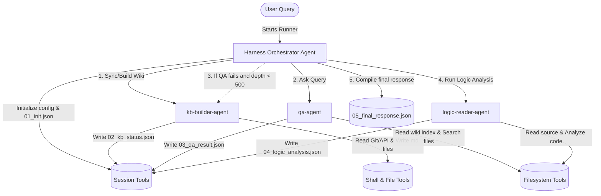

# ADK Multi-Agent Architecture

This document summarizes the design, configuration, and implementation of the 4 agents constructed using the Google Agent Development Kit (ADK) inside the `github_assistant_usingagents` workspace.

## 📁 Directory Layout

```text
github_assistant_usingagents/
├── harness-orchestrator/
│   ├── SKILL.md            # Coordination & orchestration skill instructions
│   └── agent.py            # Harness Orchestrator Agent definition
├── kb-builder/
│   ├── SKILL.md            # Git commit and issue wiki sync skill instructions
│   └── agent.py            # KB Builder Agent definition
├── logic-reader/
│   ├── SKILL.md            # Code view and logic analysis skill instructions
│   └── agent.py            # Logic Reader Agent definition
├── qa/
│   ├── SKILL.md            # Wiki ranking & QA responder skill instructions
│   └── agent.py            # Wiki QA Agent definition
├── shared_tools.py          # Unified Python tools for file operations and API calls
└── run_harness_adk.py      # Main entry point script to run the orchestrator
```

---

## 🤖 The Agents & Their Roles

### 1. Harness Orchestrator Agent (`harness-orchestrator`)
- **Folder:** [harness-orchestrator](file:///C:/Users/eshcs/OneDrive/Desktop/Antigravity%20projects/github_assistant_usingagents/harness-orchestrator)
- **Role:** Main coordinator.
- **Responsibility:** Manages the task execution pipeline. Initializes session config, calls `kb-builder-agent` to sync files, calls `qa-agent` to answer the query from the wiki, checks for dynamic fallbacks, calls `logic-reader-agent` if logic review is needed, and outputs the final response.
- **Registration:**
  ```python
  sub_agents=[kb_builder_agent, qa_agent, logic_reader_agent]
  ```

### 2. KB Builder Agent (`kb-builder`)
- **Folder:** [kb-builder](file:///C:/Users/eshcs/OneDrive/Desktop/Antigravity%20projects/github_assistant_usingagents/kb-builder)
- **Role:** Wiki Generator Specialist.
- **Responsibility:** Executes git commands to parse commits, queries GitHub REST APIs for issues/PRs, parses and classifies them, and produces sorted markdown wiki articles with cross-links.
- **Tools Equipped:** `run_shell_command`, `read_file_content`, `write_file_content`, `list_directory`, `path_exists`, `make_directory`, `http_get_request`.

### 3. Wiki QA Agent (`qa`)
- **Folder:** [qa](file:///C:/Users/eshcs/OneDrive/Desktop/Antigravity%20projects/github_assistant_usingagents/qa)
- **Role:** Wiki Information Retrieval Specialist.
- **Responsibility:** Scans the compiled wiki directories, extracts keywords, scores and ranks documents based on the query, extracts code file references, builds historical timelines, and synthesizes answers.
- **Tools Equipped:** `read_file_content`, `list_directory`, `path_exists`.

### 4. Code Logic Reader Agent (`logic-reader`)
- **Folder:** [logic-reader](file:///C:/Users/eshcs/OneDrive/Desktop/Antigravity%20projects/github_assistant_usingagents/logic-reader)
- **Role:** Codebase Logic Inspector.
- **Responsibility:** Reads specific local repository code files, traces execution logic paths, identifies error-prone blocks, and provides code diffs or recommendations.
- **Tools Equipped:** `read_file_content`, `list_directory`, `path_exists`.

---

## 🛠️ Multi-Agent Interaction Model



---

## 🚀 Execution Guide

To invoke the multi-agent system from the terminal:

```bash
# Run using the python virtual environment
.venv\Scripts\python.exe run_harness_adk.py "What is the history of the token leak?"
```

This runs the `harness-orchestrator-agent` which automatically drives the task across the sub-agents and generates all the harness transit JSON logs under `.harness/transit/`.
