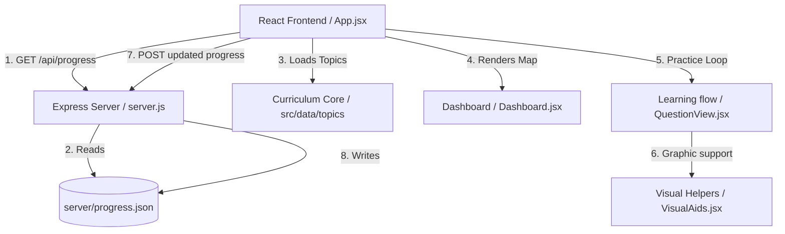

# System Architecture Overview

This section outlines the high-level system components and data-flow model of the Math Galaxy 5th Grade Prep application.

The application is structured into the following architectural layers:

## Architectural Layers

1. **[Frontend App Core](component_frontend_core.md)**
   - Manages state orchestration, coordinate correctness checking, and user profile sync.
2. **[Dashboard Planet View](component_dashboard.md)**
   - Coordinates visual game progression mapping and standard select.
3. **[Learning & Practice Flow](component_learning_flow.md)**
   - Manages tutorials, question displays, and adaptive explanation pages.
4. **[Visual Helpers](component_visual_aids.md)**
   - Renders interactive graphical supports for coordinate grids, decimals, fractions, and place value.
5. **[Curriculum Data Core](component_math_curriculum.md)**
   - Serves as the math topic question generator and tutorial slide store.
6. **[Backend Storage Server](component_backend.md)**
   - Persists client progress to a local JSON file (`server/progress.json`) via express endpoints.

## High-Level Architecture Flow Diagram

